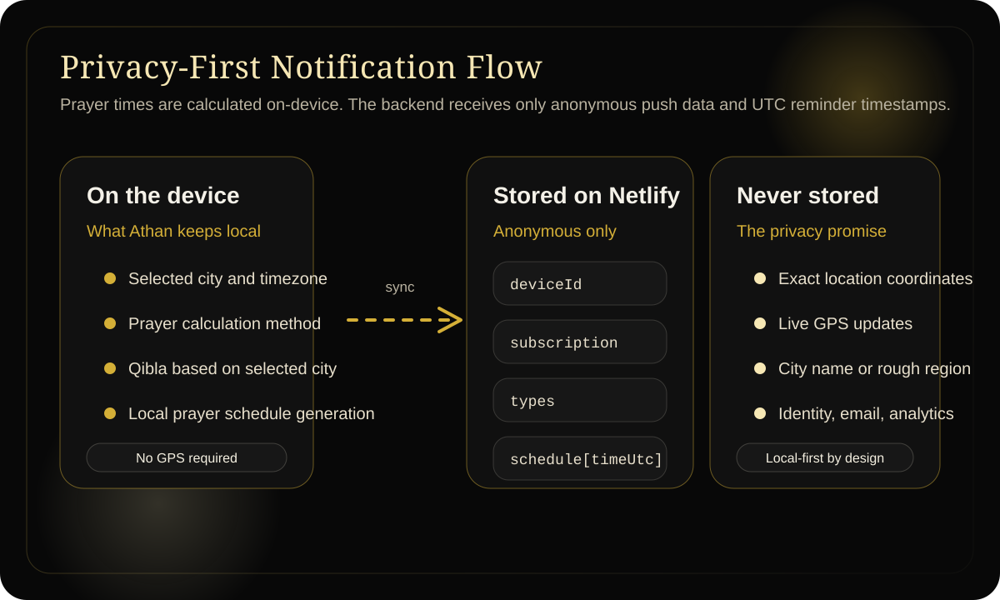

<p align="center">
  
</p>

<h1 align="center">Azan</h1>

<p align="center">
  A privacy-first prayer times PWA built around calm motion, city-based calculation, and local-first spiritual utility.
</p>

<p align="center">
  
  
  
</p>

<p align="center">
  
</p>

## Why this app exists

Most prayer apps ask for more than they need.

Azan is built around a different idea: a prayer companion should be beautiful, dependable, and deeply respectful of privacy. The app calculates prayer times on-device, lets the user choose a city instead of sharing live location, and even handles push reminders without storing the user's city or rough location on the backend.

That privacy model is the heart of this repo.

## The privacy story

### What we do not store

- No account system
- No email, phone number, or identity
- No analytics or tracking scripts
- No exact coordinates on the backend
- No city name on the backend for push notifications
- No live location history

### What we do locally instead

- The user chooses a city manually
- Prayer times are calculated on the device
- Qibla is derived from the selected city, not GPS
- User preferences live in local storage on the device
- Notification schedules are generated on the client before sync

### What the push backend stores

Push reminders are intentionally minimal. Netlify only stores the anonymous data required to deliver a notification later:

```json
{
  "deviceId": "eb560161-be9a-4c95-9f17-e18b922ef698",
  "notificationsEnabled": true,
  "subscription": {
    "endpoint": "https://fcm.googleapis.com/fcm/send/...",
    "keys": {
      "p256dh": "...",
      "auth": "..."
    }
  },
  "types": {
    "fajr": true,
    "dhuhr": true,
    "asr": true,
    "maghrib": true,
    "isha": true,
    "sunrise": false,
    "lastThird": false,
    "firstThirdEnd": false,
    "newIslamicMonth": true
  },
  "schedule": [
    {
      "id": "dhuhr-2026-03-18T10:55:00.000Z",
      "type": "dhuhr",
      "label": "Dhuhr",
      "timeUtc": "2026-03-18T10:55:00.000Z",
      "sent": false,
      "sentAt": null
    }
  ],
  "updatedAt": "2026-03-18T10:49:39.944Z"
}
```

That means the backend knows how to notify a device, but not where that person lives.

## Highlights

- Refined Islamic minimalism with a gold-on-black visual language
- Accurate prayer calculations via `adhan`
- Countdown to the next prayer
- Qibla direction from the selected city with optional compass orientation permission
- Installable PWA with offline support
- Anonymous push reminders for:
  - the five daily prayers
  - sunrise
  - last third of the night
  - first third end
  - new Islamic month at Maghrib

## How notifications work

1. The user selects a city in the app.
2. The app calculates prayer times locally.
3. The app turns the upcoming reminders into UTC timestamps.
4. It syncs only the push subscription, reminder toggles, and UTC schedule to Netlify.
5. A scheduled Netlify Function checks due reminders and sends the push.
6. The service worker displays the notification on the device.

This keeps the sensitive calculation context on the client while still enabling background reminders.

## Qibla without location tracking

Azan does not need live GPS to show Qibla.

- Qibla is calculated from the currently selected city coordinates
- On supported devices, compass/orientation permission helps rotate the indicator live
- That is a sensor permission, not a location permission
- The app never needs to continuously watch where the user is standing

This is especially important for users who want directional guidance without turning their phone into a tracker.

## Screens and assets

<p align="center">
  
</p>

Current brand and notification assets used in the app live in `static/` and `static/images/`.

## Stack

- SvelteKit
- Svelte
- `adhan` for prayer times and qibla math
- Netlify Functions for push endpoints
- Netlify Blobs for anonymous device records
- Web Push (`web-push`) for notification delivery

## Local development

```bash
npm install
npm run dev
```

Build for production:

```bash
npm run build
npm run preview
```

## Push environment variables

For notification support, configure:

```env
VITE_VAPID_PUBLIC_KEY=your_public_vapid_key_here
VAPID_PUBLIC_KEY=your_public_vapid_key_here
VAPID_PRIVATE_KEY=your_private_vapid_key_here
VAPID_SUBJECT=mailto:you@example.com
```

Notes:

- `VITE_VAPID_PUBLIC_KEY` is intentionally public and bundled to the client
- `VAPID_PRIVATE_KEY` must remain secret
- `VAPID_SUBJECT` should be a real contact identifier like `mailto:hello@yourdomain.com`

## Deploying

Azan is designed for static hosting with Netlify-backed push support.

- Standard PWA hosting works for the app itself
- Netlify is the intended deployment target when push reminders are enabled
- Scheduled Functions are used to send due reminders from the stored UTC schedule

## Install

### iPhone / iPad

1. Open the site in Safari
2. Tap Share
3. Tap `Add to Home Screen`

### Android

1. Open the site in Chrome
2. Open the browser menu
3. Tap `Install` or `Add to Home Screen`

## Repo direction

This repo is not just trying to be another prayer app.

It is trying to prove that a modern spiritual tool can feel premium while still being disciplined about privacy:

- no live location requirement
- no location storage on the backend
- no identity layer
- no analytics dependence
- no compromise on design

If that philosophy matters to you, this is the core idea behind Azan.
